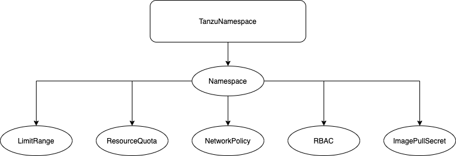

# namespace-operator

## Project Motivation

The namespace-operator project is a project designed for implementing best practices for each namespace created
within a Kubernetes environment.  More specifically, it was implemented to take into account best practices
from several years of production-level, field experience from the engineers currently working at VMware.  The model
is designed to implement a level of tenancy within each Kubernetes cluster which satisfies many production
requirements.  Best practices for namespace-operator are derived from guides in the Tanzu Developer Center
(Workload Tenancy Guide) as documented at https://tanzu.vmware.com/developer/guides/kubernetes/workload-tenancy/.

## Architecture Overview

The architecture for namespace-operator is built off of a single construct called a `TanzuNamespace`. This construct
is a Kubernetes `CustomResourceDefinition` which is responsible for the creation and reconciliation of several other
subordinate constructs such as the following:

- `Namespace` - first and foremost, a namespace is created based off of each `TanzuNamespace` object.  The namespace
  is in place to represent a tenant for a workload.
- `LimitRange` - for each `TanzuNamespace`, a limit range is created to give a sane resource range for workloads that reside
  within the namespace (tenant).  See https://kubernetes.io/docs/concepts/policy/limit-range/.  Limit ranges may be adjusted
  but are defaulted to a low value by default to encourage administrators to specify the values that
  they need.
- `ResourceQuota` - for each `TanzuNamespace`, a resource quota is created to provide a sane limitation for resources to
  be consumed within that namespace.  See https://kubernetes.io/docs/concepts/policy/resource-quotas/.  Resource
  quotas may be adjusted but are defaulted to a low value by default to encourage administrators to specify the values that
  they need.
- `NetworkPolicy` - for each `TanzuNamespace`, a network policy is created to provide microsegmentation for the namespace/tenant.
  See https://kubernetes.io/docs/concepts/services-networking/network-policies/.  **NOTE:** network policy implementation is
  highly dependent on the Kubernetes CNI selection.  Please ensure your CNI implements the NetworkPolicy spec to use.
- **RBAC (Not Yet Implemented)** - for each `TanzuNamespace`, the namespace-operator will lay down some role-based access
  control to implement the workload administrator, developer, and view roles along with associated service accounts and role bindings.
  **NOTE:** this is not yet implemented as of this writing.
- **ImagePullSecret (Not Yet Implemented)** - for each `TanzuNamespace`, an `ImagePullSecret` is created to allow workloads
  in the namespace to pull images from private image repositories.

## Architecture Diagram



**NOTE:** RBAC and ImagePullSecret are not yet implemented.  Diagram to represent idea only.

## Installation

Simply run the command `make k8s-platform` against a cluster in which you wish to install the operator against.  The command
will install the following objects into your cluster:

- TanzuNamespace CustomeResourceDefinition
- RBAC for namespace-operator deployment
- namespace-operator deployment


## Usage

The following is a representating of a `TanzuNamespace` resource definition (see `config/samples/tenancy_v1alpha1_tanzunamespace.yaml`):

```yaml
---
apiVersion: tenancy.platform.cnr.vmware.com/v1alpha1
kind: TanzuNamespace
metadata:
  name: tanzunamespace-sample
spec:
  # common attributes
  name: "tanzu-namespace"

  # limit range
  limitRange:
    defaultCPULimit: "200m"
    defaultMemoryLimit: "128Mi"
    defaultCPURequest: "100m"
    defaultMemoryRequest: "64Mi"
    maxCPULimit: "1000m"
    maxMemoryLimit: "512Mi"

  # resource quota
  resourceQuota:
    requestsCPU: "8"
    requestsMemory: "10Gi"
    limitsCPU: "16"
    limitsMemory: "20Gi"

  # network policies
  networkPolicies:
    - targetPodLabels:
        app: nginx
      egressUDPPorts:
        - 53
      egressNamespaceLabels:
        name: kube-system
    - targetPodLabels:
        app: nginx
      ingressTCPPorts:
        - 80
        - 443
      egressTCPPorts:
        - 80
        - 443
    - targetPodLabels:
        run: nginx
      ingressTCPPorts:
        - 80
        - 443
      ingressNamespaceLabels:
        name: tanzu-namespace
      ingressPodLabels:
        app: nginx
      egressTCPPorts:
        - 80
        - 443
      egressUDPPorts:
        - 53
```

The above can be applied via standard `kubectl apply -f <tanzu_namespace_file>`, substituting the appropriate values as necessary.
